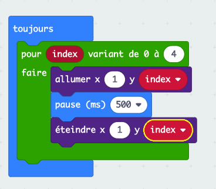
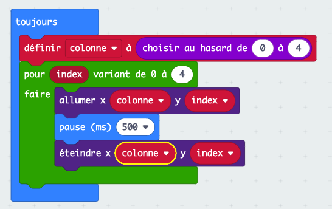
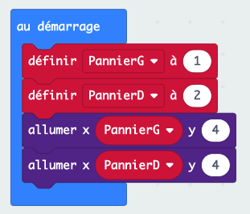
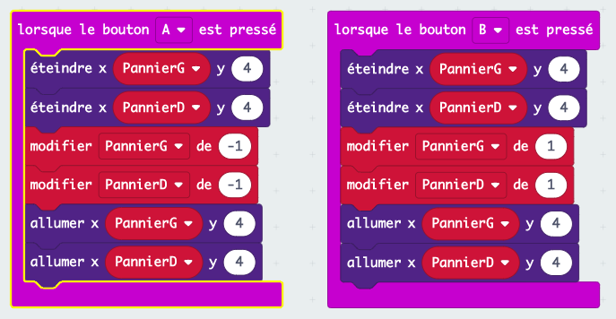
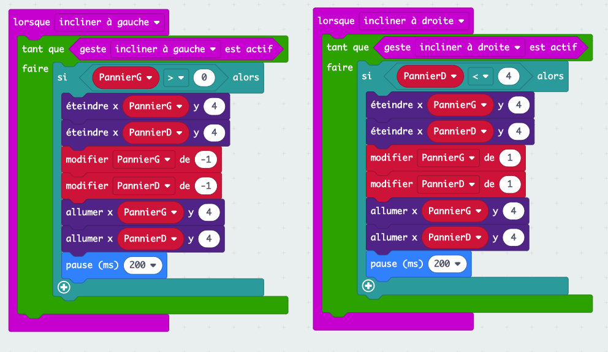
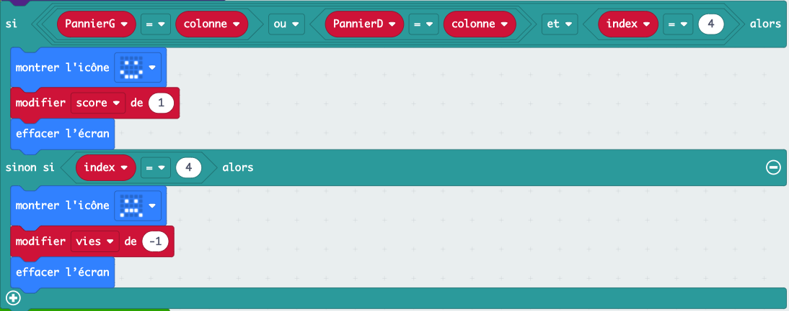
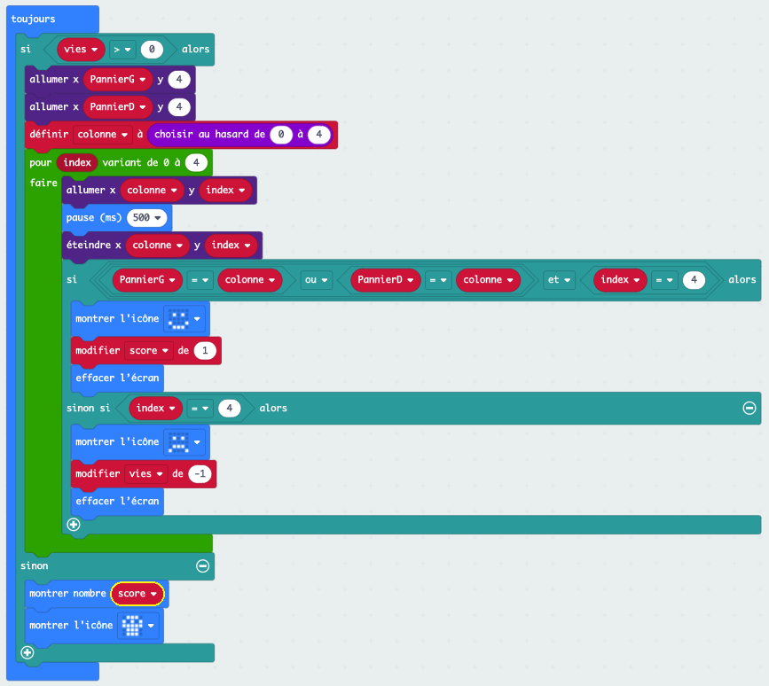
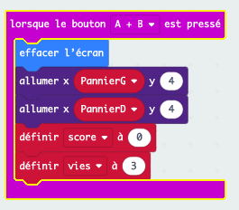
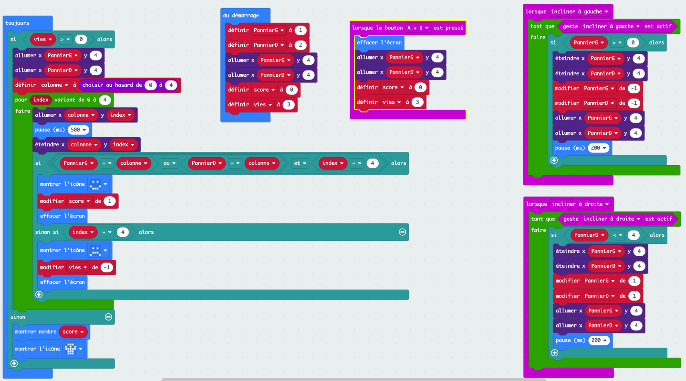

# Catch the fruit

## Introduction

Une introduction à la programmation avec les micro:bit où il s'agit de coder un petit jeu de type .

```{youtube} vE4-GZSi5wY
:start: 5
```

L'idée est d'utiliser la matrice de 25 leds du micro:bit comme écran sur lequel un fruit représenté par 1 led va tomber du haut de l'écran et qu'il faudra rattraper dans un panier, 2 leds adjacentes, qui sera déplacé en utilisant le gyroscope intégré, i.e. en penchant le micro:bit.

## Objectifs du cours

Faire découvrir différents concepts de programmation au fur et à mesure de la réalisation d'un jeu.  
Les concepts utilisés sont :

* Variables
* Boucles
* Structures conditionnelles

## Durée

2 x 2 périodes de cours en salle d'informatique avec des micro:bit.

## Matériel requis

Des ordinateurs avec connexion à internet pour accéder à la plateforme de programmation [MakeCode](https://makecode.microbit.org/) à l'aide d'un navigateur (Chrome recommandé).
Des micro:bit pour les élèves, au moins 1 pour 2.

## Accroche

Coder un jeu qui utilise les capacités interractives du micro:bit.

## Marche à suivre

### Étape 0 - Analyse des besoins

#### Objectif : Prendre conscience de la nécessité de réfléchir avant de coder

#### Définition des besoins

Les étapes suivantes sont en générale assez vite identifiées :

1. Faire tomber un fruit
2. Déplacer le panier
3. Détecter lorsqu'un fruit est attrapé (i.e. collision fruit-panier)
4. Gestion des échecs (i.e. fruit n'est pas attrapé)
5. Fin du jeu et nouvelle partie

### Étape 1 - Faire tomber un fruit

#### Objectif

Programmer la visualisation d'un fruit qui tombe sur une des 5 colonne choisie aléatoirement.

#### Exercice 1

Commencer par faire le rendu visuel sur une colonne prédéfinie.  
Déterminer avec les élèves quelles sont les actions à faire faire au micro:bit : allumer puis éteindre successivement les leds de la colonne choisie.  

On utilise les blocs `allumer` et `éteindre` du menu `LED`. Ces blocs ont besoin des coordonnées `x` et `y` de la led.  

##### Questions

* Où se trouve le (0,0) ?
* Comment le vérifier ?

##### Résultat attendu


##### Problèmes

On ne voir rien qui se passe !  
C'est dû au fait que le micro:bit effectue les opérations trop rapidement pour que notre œil le voit, il faut mettre des pauses avant d'éteindre chaque led.

Si au lieu d'avoir un écran de 5 leds de hauteur il en faisait 50, ou 100, ce code deviendrait vite laborieux à écrire... comment faire ?

#### Exercice 2

En regardant de plus près les blocs utilisés, on remarque la répétition des 3 mêmes blocs : `allumer`, `pause` et `éteindre`.  
Quand on a une répétition d'instruction, on veut que ce soit l'ordinateur qui fasse le travail : on utilise les **boucles**.

Présenter les différents types de boucle et faire revenir aux blocs en place.

##### Questions

* Qu'est-ce qui est stable ? (la succession des 3 blocs)
* Qu'est-ce qui ne change pas ? (`x`)
* Qu'est-ce qui varie, et comment ? (`y` par incrément de 1)
* Quel type de boucle doit-on utiliser ? (une boucle de type `répéter`)

Cependant, en réponse à la dernière question, le bloc `pour index variant de 0 à 4` semble encore plus adapté 
puisqu'on a `index` qui prend les valeurs de 0 à 4, ce qui est exactement ce qu'il nous faut pour les valeurs de `y`.
Introduction de la notion de `variable` dont on va se servir tout de suite après.

##### Résultat attendu



##### Problèmes

Le fruit tombe toujours dans la même colonne, on veut changer de colonne pour chaque fruit et que le choix de la colonne soit aléatoire.

#### Exercice 3

Pour choisir un nombre au hasard, on peut utiliser le bloc `choisir au hasard de 0 à 10` du menu `Maths`.  
Ce bloc permet de choisir un entier entre 2 bornes, dans notre cas de 0 à 4.

##### Questions

* Comment et où utiliser ce bloc ?
* Que va-t-il se passer si on le met à la place de `x` dans les blocs `allumer` et `éteindre` ?

Il faut donc choisir un nombre au hasard qui va être la colonne choisie et il faut pouvoir conserver ce choix tout au long de la chute du fruit.  
Dès l'instant où on veut stocker de l'information pour pouvoir la réutiliser, la solution est d'utiliser une `variable`.

##### Résultat attendu



Fin de l'étape 1, on a un fruit qui tombe dans une colonne choisie aléatoirement.

### Étape 2 - Déplacer le panier

#### Objectif

Programmer la visualisation d'un panier qui se déplace sur la ligne du bas en utilisant le gyroscope du micro:bit,
c'est à dire en l'inclinant à droite ou à gauche.

#### Exercice 4

Pour commencer il faut choisir comment sera représenté le panier, en général, 2 leds adjacentes.  

##### Questions

* La position du panier va changer au cours du jeu, comment faire pour stocker de l'information qui varie ? (utiliser des variables)
* Que doit-on représenter avec ces variables ? (la position en X du pannier, Y vaut toujours 4, car sur la dernière ligne)
* Combien de variables va-t-on utiliser ? (1 suffit, 2 est plus simple à conceptualiser, à choix)

Partons sur 2 variables, `PannierG` et `PannierD`. On choisi la position de départ du pannier et on initialise les variables en conséquence.  
Si on oublie d'allumer les leds correspondantes, on ne verra pas le panier !

##### Résultat attendu



##### Problèmes

Le pannier est fixe, il faut le faire bouger.

#### Exercice 5

Dans un premier temps, pour faciliter le développement et les tests, on va plutôt utiliser les boutons `A` et `B` pour les déplacements gauche et droite, respectivement.  

##### Questions

* Que signifie déplacer le panier à gauche (resp. à droite) en termes de positions ? (diminuer les valeurs de ses coordonnées de 1, resp. les augmenter de 1)
* Que doit-il se passer visuellement ? (éteindre les leds de la positon actuelle, faire le déplacement, allumer les leds de la nouvelle position)

On doit donc éteindre les leds du pannier, faire le déplacement, allumer les leds du panier. On le fait avec `A` pour le déplacement à gauche et avec `B` pour le déplacement à droite.

##### Résultat attendu



##### Problèmes

Si on appuie de nombreuses fois sur le bouton `A` (resp. `B`), le panier disparait, il sort de l'écran.
Ce n'est pas le comportement voulu, spécialement si on garde à l'esprit que le déplacement se fera, in fine, par inclinaison du micro:bit.

#### Exercice 6

On veut empêcher le pannier d'aller plus loin que les bords de l'écran.

##### Questions

* Pourquoi est-ce que le pannier sort de l'écran ? (les variables continuent d'être modifiées pour finalement engendrer l'allumage de leds à des coordonnées qui n'existent pas)
* Comment empêcher la modification des variables ? (conditionner les modifications selon la position du panier)
* Sous quelle condition le panier peut se déplacer à gauche (resp. à droite) ? (si la position en X de sa partie gauche (resp. droite) est > 0 (resp. < 4))

On introduit ici la structure de contrôle conditionnelle `si ... alors ...` et les tests de comparaison qui *répondent* `vrai` ou `faux` et servent de condition à l'exécution d'instructions. Ici, le déplacement du panier.

##### Résultat attendu


##### Problèmes

Le panier se déplace avec les boutons, on veut utiliser l'inclinaison du micro:bit pour faire bouger le panier.

#### Exercice 7

Pour utiliser l'inclinaison du micro:bit, le remplacement des `Entrées` de type *lorsque bouton pressé* par celles de type *lorsque incliner* est assez évidente.
Par contre, lors de l'utilisation on remarque que l'inclinaison n'engendre qu'un seul déplacement et qu'il faut repasser par l'horizontal pour faire un nouveau déplacement.

##### Questions

* Pourquoi seul 1 déplacement est effectué et il est nécessaire de repasser par la position horizontale ? (l'inclinaison est un déclencheur comme l'appui sur `A`)
* Quel est en fait le comportement attendu ? (le pannier se déplace **tant que** le micro:bit est incliné)

On rajoute une boucle `tant que` conditionnée par l'inclinaison du micro:bit pour faire les déplacements déclanchés par l'inclinaison.  
Comme pour la chute du fruit, si on oublie la `pause`, le panier se déplace d'un bord à l'autre instantanément. Laisser les élèves faire le rapprochement.

##### Résultat attendu



Fin de l'étape 2, on a un pannier qui bouge lorsque le micro:bit est incliné.
Certains élèves auron surement remarqué que lorsque le fruit tombe dans le panier, le panier disparait.
Avant de s'occuper de la collision à proprement parler, on peut remédier ce problème simplement en *rallumant* le panier avant chaque chute de fruit.

### Étape 3 - Détecter lorsqu'un fruit est attrapé

#### Objectif

Il s'agit maintenant de détecter lorsque le fruit est attrapé par le panier, c'est-à-dire lorqu'il y a collision entre le fruit et le panier et réaliser les actions qui en découle.

#### Exercice 7

Visuellement il est facile de *voir* quand le fruit tombe dans le panier, mais comme le micro:bit ne *voit* pas, il faut trouver une autre solution pour qu'il puisse vérifier s'il y a collision ou non.

##### Questions

* A quelle condition y a-t-il collision entre le fruit et le panier ? (lorsque les coordonnées / positions du fruit et du pannier sont les mêmes. Il est vraisemblable que plusieurs reformulation soient nécessaires pour obtenir la bonne réponse)
* Quelles sonts les coordonnées respectives du panier et du fruit ? (comme elles changent, varient, elles sont dans des variables. Fruit(`colonne`, `index`) et Panier(`PannierG` ou `PanierD`, `4`))
* Comment s'écrit l'égalité des coordonnées avec ces variables ?

**(PanierG = colonne OU PanierD = colonne) ET index = 4**

Avant de traduire cette condition avec des blocs, il faut insister sur les priorités liées aux parenthèses de l'expression ci-dessus.

##### Résultat attendu


##### Problèmes

On a maintenant un test permettant de détecter la collision entre un fruit et le panier, mais on fait quoi ?

#### Exercice 8

Il s'agit maintenant de déterminer à quel moment du jeu il faut faire ce test, mais aussi quelles sont les actions à réaliser lorsqu'il y a collision.  
Sans rentrer dans le détail de la portée des varibles, on peut juste utiliser le fait que la variable `index` soit utilisé dans notre test pour guider et justifier le position du test dans le code.

##### Questions

* A quel moment veut-on tester la collision ? (après chaque déplacement du fruit, i.e. dans la boucle `répéter`, en dehors, le fruit n'existe pas )
* Que doit-il se passer lorsqu'on attrape un fruit ? (on marque 1 point)
* Comment faire pour tenir le score à jour ? (il faut utiliser une variable)

L'implémentation de ces éléments ne pose pas de problème, cependant il ne faut pas oublier d'initialiser le score à 0 `au démarrage`.  
En outre, on peut également *fortement* suggérer de donner un signal visuel au joueur lorsqu'il marque un point ; avec l'apparition d'une icône, par exemple.

##### Résultat attendu


##### Problèmes

Si l'icône a été ajoutée comme visualisation du point marqué, lorsque le jeu continue, l'icône est toujours présente et perturbe la jouabilité. Pour y remédier, il suffit d'`effacer l'écran` après avoir modifié le score.

Fin de l'étape 3, lorsqu'un fruit tombe dans le panier, on le détecte et on marque un point.

### Étape 4 - Gestion des échecs

#### Objectif

Un échec est lorsqu'un fruit fini sa chute en dehors du panier. Il faut détecter lorsque ce cas se produit et également définir les actions associées.

#### Exercice 9

L'échec n'est pas seulement le contraire du fruit qui tombe dans le panier, car cela inclut également tous les cas ou le fruit est en train de tomber, qu'il soit au-dessus du panier ou non.  
Il faut donc déterminer comment détecter ces cas là uniquement.

##### Questions

* Quels sont les positions du fruit concernés par le `sinon` du bloc permettant de détecter les collisions ? (toutes les positions sauf celles du panier)
* Toutes ces positions constituent-elles des échecs ? (non)
* Quelle condition supplémentaire doit-on avoir pour que le fruit soit tombé à côté du pannier ? (index = 4)
* Que se passe-t-il lorsqu'on rate un fruit ? (perte de vie, par exemple)

Là aussi, une fois les réponses déterminées, l'implémentation ne pose pas de difficultés particulière. A l'instar de la collision, on peut ajouter un signal visuel pour signifier l'échec au jouer. Dans ce cas, il ne faut pas oublier d'`effacer l'écran`. Il ne faut pas non plus oublier d'initialiser le nombre de `vies` au démarrage.

##### Résultat attendu



##### Problèmes

Le jeu est maintenant fonctionnel, on marque des points lorsqu'un fruit est attrapé et on perd une vie quand on le rate. Cependant, le jeu ne s'arrête pas même si on a perdu plus de vies qu'on en avait au départ.

Fin de l'étape 4, pour finaliser le jeu il va falloir qu'il s'arrête lorsqu'on a plus de vie et qu'on ait la possibilité de recommencer une nouvelle partie.

### Étape 5 - Fin du jeu et nouvelle partie

#### Objectif

Déterminer lorsque le jeu doit s'arrêter et trouver une solution pour recommencer une partie.

#### Exercice 10

Faire s'arrêter le jeu selon une condition à déterminer.

##### Questions

* Quand est-ce que le jeu doit s'arrêter ? (lorsqu'on a plus de vies)
* Quelle est la condition qui permet de continuer à jouer ? (si le nombre de vies > 0)
* Quelle partie du jeu suffit-il d'empêcher pour que le jeu soit fini, de facto ? (la chute des fruits)
* Que doit-on faire lorsque le jeu est fini ? (afficher le score, signifier le Game Over au joueur)

L'arrêt du jeu s'implémente simplement en conditionnant la chute des fruits au fait d'avoir au moins une vie, l'alternative (sinon) étant la fin de partie avec affichage du score.

##### Résultat attendu



#### Exercice 11

Donner au joueur la possibilité de recommencer une partie, par exemple en appuyant sur `A + B`.

##### Questions

* Qu'est-ce qui fait qu'on a perdu, qu'on ne peut plus jouer ? (on a plus de vies)
* Que faudrait-il pour que le jeu recommence ? (avoir de nouveau des vies)
* Est-ce qu'il y a autre chose qu'il faudrait faire pour que ce soit une nouvelle partie ? (remettre le score à 0, effacer l'écran, allumer le pannier, tout ce qui est fait au démarrage)

Pour finir, aucune difficulté d'implémentation, il reste simplement à tester le jeu et vérifier les détails d'affichage.

##### Résultat attendu



Ceci termine l'implémentation de base de ce jeu sur micro:bit.  
Une version du jeu complet est disponible [ici](./FruitCatch.hex), il suffit de le déposer dans la fenêtre Makecode ouverte dans votre navigateur.

## Pour aller plus loin

Pour rendre le jeu plus intéressant et donner aux élèves l'occasion de faire des expérimentations et remobiliser ce qu'ils viennent de voir, on peut demander à la classe ce qu'on pourrait faire pour augmenter la difficulté du jeu et les laisser essayer d'implémenter quelques unes de leur suggestions.  
Des suggestions qui reviennent régulièrement : 

* Augmenter la vitesse de chute du fruit tous les X points
* Diminuer la vitesse de déplacement du pannier tous les Y points
* Faire tomber de manière aléatoire des fruits pourris / bombes qui font perdre une vie si atttrapés (on peut jouer avec la luminosité pour faire la distinction)
* Faire tomber plusieurs fruits
* Perturber la chute du fruit qui ne reste plus sur sa colonne initiale (attention aux cas en bord de l'écran)
* Inverser les commandes


